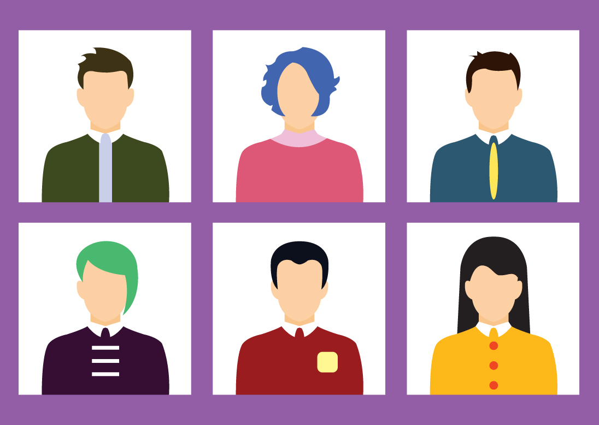
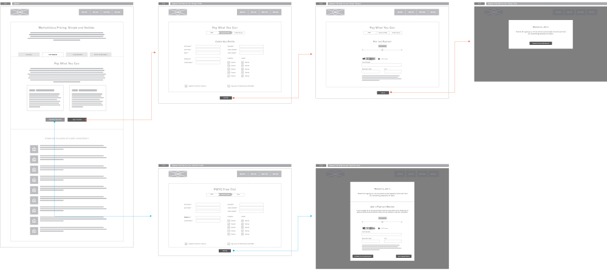

Design is a process. But it doesn’t have to be a difficult and unorganized process. Over the past few years, we've added new tools and techniques that have streamlined and improved our process. One of the most important techniques is designing user flows, which is part of our approach to [human-centered design](https://blog.kohactive.com/human-centered-design/)

The problem with sitemaps, wireframes and page layouts is that they don't address the users' needs. Instead, they just create a visual architecture for what pages will look like. User flows, on the other hand, allow us to address users’ needs before we begin the visual designs process, which should help us create better product.

## User Flows Begin With The User

User experience isn't just about smart architecture and good design, it's the intersection of the user and business objectives. Before you begin designing sitemaps, wireframes or layouts, you should be focusing on [User Research](https://www.kohactive.com/playbook/designing/user-research/). Who are they, what are they trying to accomplish and how can you make their experience more succesful. We create [User Personas](https://www.kohactive.com/playbook/discovery/personas/) to define our end users.

Users don't just land on pages from anywhere, they arrive there to achieve a specific goal. Whether they are trying to download a whitepaper, sign up for your sevice, or purchase a product, they have an objective that we must identify and design for.

## What Are User Flows

User flows are simple diagrams that illustrate the steps involved in achieving a goal. These flows can be an in-app experience, a cross-application experience or even a cross-device experience.

#### In-App User Flow

An e-commerce checkout flow is a basic example where a user wants to purchase a product but is required to add their address, billing and payment information before they can complete their purchase. You've probably experienced this hundreds of times.

#### Cross-Application User Flow

User flows don't have to be designed within your own website or app, it can be part of a larger flow. You can create user flows around ad units. For example, a banner ad that leads to a landing page where you want to collect email subscriptions. This flow would use a third party website, your own website, an email signup form and, most likely, a confirmation email.

#### Cross-Device User Flow

Sometimes you need users to pick up another device in order to accomplish their goal. These are tricky situations and need be handled with care. For example, sometimes an application requires you to confirm your phone number by sending you a text message with a code that you have to confirm.

## How To Design User Flows

User flows come in few different formats. First we start with low-fidelity shorthand flows and eventually create clickable prototypes.

### Shorthand Flows

We begin our user flows with shorthand diagrams that we sketch on paper or on the whiteboard. [Ryan Singer](https://www.twitter.com/rjs), of Basecamp, has [a great post](https://signalvnoise.com/posts/1926-a-shorthand-for-designing-ui-flows) on writing shorthand flows.

We typically create our first user flows during our planning session or design sprints. It's important to address flows prior to creating sitemaps or wireframes.

### Wireframe Flows

Once we've finalized the first iteration of wireframes, we'll use them to create a visual flow. Wireframe flows are a simple way to visualize the entire experience. This should fit well with our information architecture as well. This step isn't required but it's a nice way to see a higher level view of your UX.

### Prototypes

Prototypes are the next iteration of user flows. Once your wireframes or visual designs are completed, you can use a tool like InVision or Marvel to create clickable flows.

Many times for web or mobile apps, I like to abstract individual flows into their own clickable prototypes to test in isolation. Eventually, I'll put them all together into a full product prototype.

## Conclusion

When creating [custom software](https://www.kohactive.com/services/custom-software-development/), we always start with the users, and creating user flows has become a vital part of our process. In a way, they're like prototype, they help experience a process or product without building it. With relatively little overhead, user flows should be incorporated into any design process. They are a great way of addressing user needs while maintaining your business objectives.
