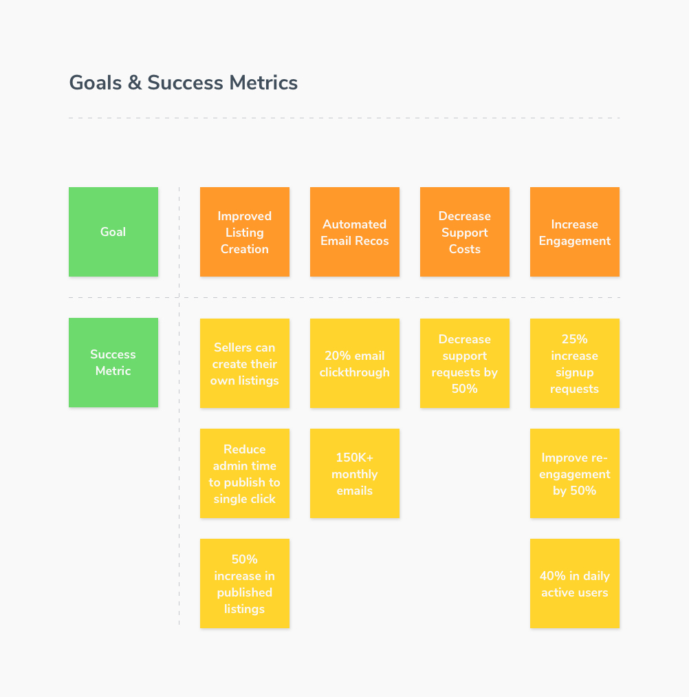
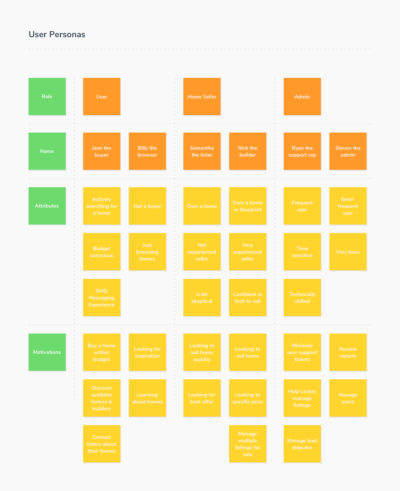
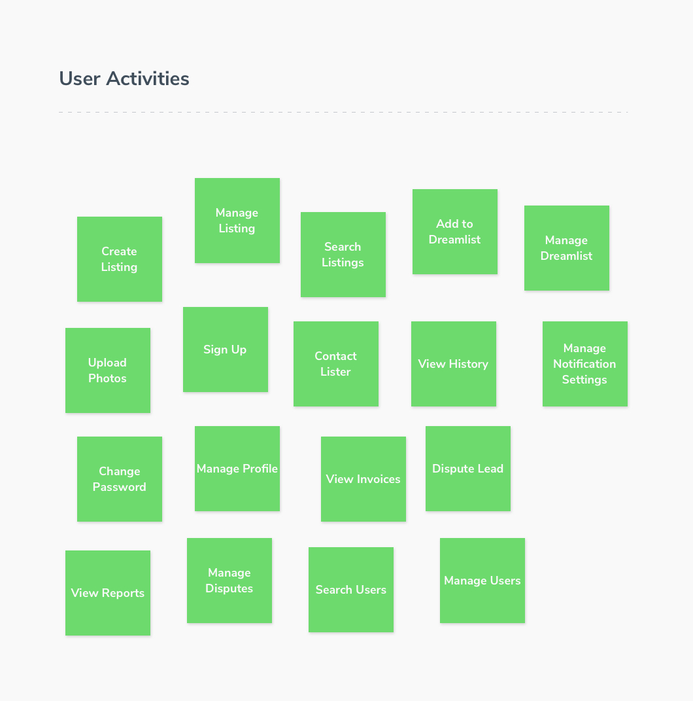
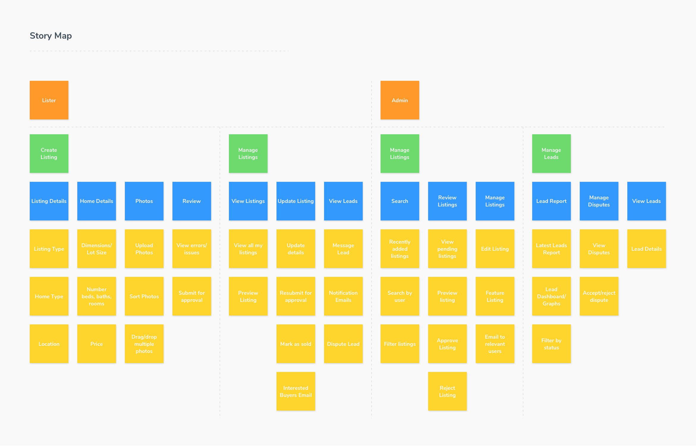

Over the past few years, we've employed immersive workshops to improve requirements gathering and accelerate product development cycles. Since the first workshop, our process has evolved quite a bit. I want to share with you what we've learned over the past few years and how we currently implement our Product Design Workshop.

Requirement gathering is necessary to build quality digital products – from small internal applications to large enterprise systems. Many organizations task an analyst or internal project manager with scoping out the requirements for a project. That individual will spend days or even weeks talking to stakeholders to create a massive document of requirements that is probably outdated or filled with inaccuracies. This time-consuming process is expensive and relatively ineffective.

Good requirement gathering is about having the right people together to align on vision and goals for a project. You can expect the following key outcomes:

- A clearly defined business goal
- Clearly defined success metrics
- A shared understanding of the business process, end users, and their pain points
- Shared agreement on the product scope and priorities
- An uncovering of hidden requirements
- A product release strategy

Our workshops are typically two or three half-day sessions. While we prefer multi-day workshops, we occasionally host full-day workshops.

We start every project out with a Product Design Workshop. Whether it's a greenfield project, rebuilding an existing system, or adding a new feature, workshops help us quickly paint a picture of the project and get complete buy-in.

## The Players

A successful workshop requires the right players,  which is a collection of Kohactive and client team members. We'll need key stakeholders, subject matter experts, users, and internal project managers. During the session, we'll be making decisions on scope and priorities, so it's critical to have the right decision makers in the workshop. From our team, you can expect a product manager, designer, and developer.

We understand that getting key stakeholders together for an extended workshop can be challenging, but it's required to deliver the expected outcomes. The time invested in the workshop will pay dividends in saved time building the right product within budget and time.

## Project Charter

We'll kick off the workshop by understanding the _why_. _Why_ are we here? We'll build a shared understanding of the project by developing the project charter. The project charter is a document that outlines the problem statement, timeline, players, and project goals. The charter helps us stay focused and ensures the product decisions we make fit in line with our goals.

#### Problem Statement

The first part of the charter identifies the problem statement. What is the problem that we're solving for? The problem statement should be phrased as a question. The statement should provide clarity into the product that we're building. It imposes constraint so we can focus on _why_ we are building this product.

#### Timeline

An agreed upon timeline is next. How much time is available to build and launch the project? If you have a specific deadline or timetable, we'll need to identify and agree upon it. Sometimes, we have multiple timelines for releases.

#### Players

Who is involved in the project? During the workshop, we'll identify the key players including your team and ours. We'll identify the following roles:

- **Stakeholders** (executive sponsors, project managers, etc)
- **Subject Matter Experts **(business area experts)
- **Builders **(product managers, designers, developers)
- **End Users** (actual users of the new product)

Understanding these roles will help us all build alignment on key decisions and insights.

#### Goals & Success Metrics

The last part of our charter identifies the goals for the project and how we are defining success. These should be scoped to the project, not necessarily the business goals, although these commonly overlap. Our goals should be achievable through the decisions we make building the product.

Here is an example of the output of defined goals and success metrics.

## User Personas

The next part of our workshop is identifying the personas of users of the product. These don’t represent real people, but a representation of individuals that will be using your product. We use these personas to identify whether the decisions we make about the product provide real value for our users.

Personas are composed of three things: name, attributes, and motivations. Creating personas enables us to make smarter decisions. How comfortable are users with technology? How often will they use the product? What are their motivations for using it? Understanding the users helps us answer these critical questions.

Here is an example of user personas created in detail.

## Map the big picture

The project charter and personas help build alignment on why we're here and who we're solving for. Now it's time to map out the big picture.

We start by identifying key activities. Activities organize tasks done by a user to complete a task. These are high-level like "checkout", "create listing", or "book flight". Activities can range in size and span across multiple user personas. There are no rules here other than keeping the activities short and high-level. We encourage free-thinking and new ideas, no idea is a bad idea.

Once all activities have been identified, we'll work as a team to organize them into groups based on functionality. Then we'll go through each group and begin the story mapping process. A key stakeholder or subject matter expert will walk through the problem by telling a story of the activities and tasks they (or a user) would perform. We’ll write down the tasks and stick them on the wall from left to right to see a timeline of the flow.

Each key activity should have one more many tasks. For example, an activity of "checkout" may have tasks like "view cart", "select payment method", "select shipping address", "review order", and "complete order".

We will repeat this for all activities and make sure we've identified all tasks involved. Once the team reviews and approves the high-level mapping, then we'll go into detail.

The working story map should start to look something like this:

## Explore and Detail

Once the big picture is mapped out, it's time to explore and detail all of the activities and tasks. We'll do this by identifying the personas involved in each particular activity as well as the subtasks involved.

Each activity should satisfy a need or goal for a user persona. Sometimes multiple personas can engage in the same activity or even in different parts of the same activity. As a team, we'll go through each activity and identify the personas by adding them to the story map.

Once the personas have been added, we'll identify all subtasks that a user might engage in. For example, an activity includes a task of "search for a product", the subtasks highlight the different ways they can search or filter products. We'll go through each activity and task to detail all of the subtasks required, regardless of priority or importance. It's important to get as detailed as possible during this process.

At this point, we'll have a large story map that looks something like this:

## Release Planning

Now that our story map is complete, it's time to slice out the various releases. What outcomes do we want to focus on first? What can be pushed to the next release or even further down the road?

Our project charter should help guide the decisions we make during this phase. What features that we identified in the story map solve the problem statement and achieve the goals that we defined? These activities and stories should be marked for the first release. Which features are a priority but don't directly solve our goals? These should be marked as the second or third release.

There are always more ideas than time and money, and this is our opportunity to prioritize what will create long-lasting value for your organization. Our team will challenge you during the slicing phase to ensure we have clear priorities and a path for success. Every feature adds more complexity and risk. Through release planning, we can reduce risk and ensure we're building the right product.

Here's what a story map that has been sliced into releases looks like:

## The Outcome

The Product Design Workshop will help us envision a solution for a critical business problem by building alignment on scope and priorities. All participants will develop a shared understanding of the business goals, processes, and outcomes of the project. In a short time, we can accomplish what would usually take weeks to complete–with fewer errors and better alignment.

The project charter and story map become the foundation for the project. Since all key players participate in the workshop, there is less and forth on goals, features, and functionality. There are fewer conflicts regarding outcomes and priorities. There is a unified goal and a solid plan of attack.

While the Product Design Workshop is a powerful way to kickoff a project, it's only part of the discovery process. These requirements are used to conduct user research, create mockups of key screens, and develop the technical architecture of the product.
