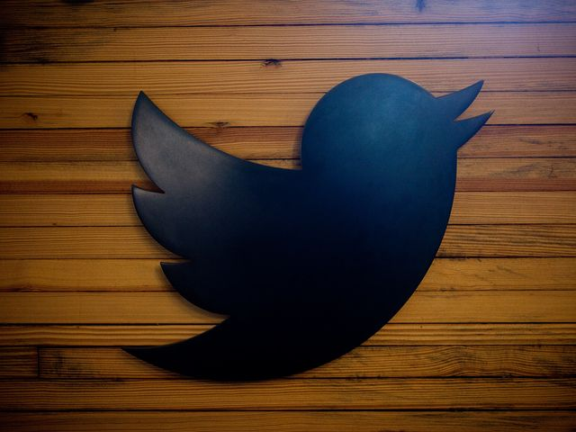
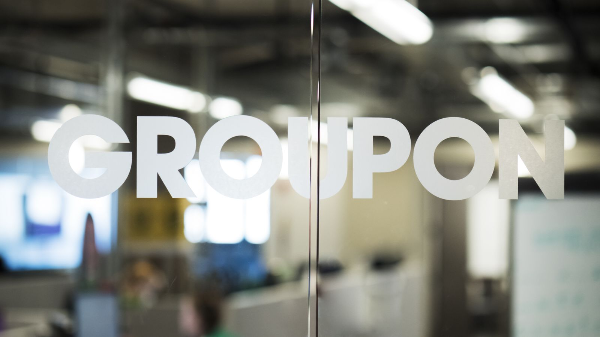
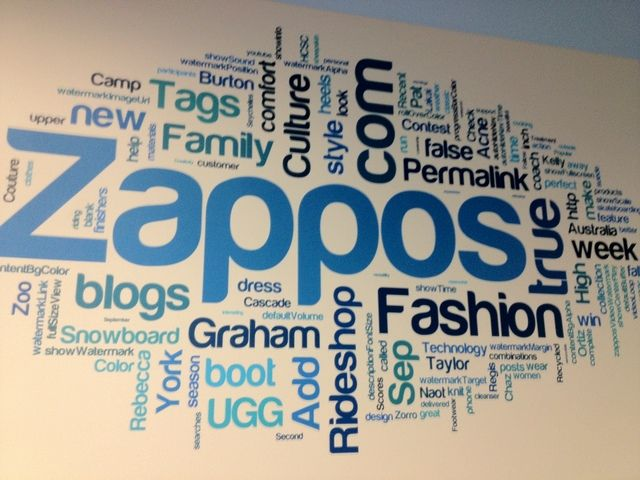
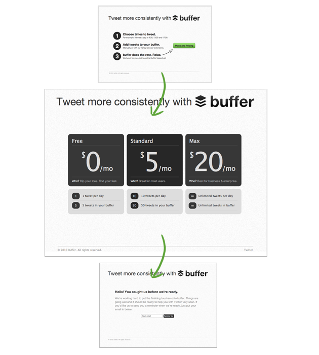
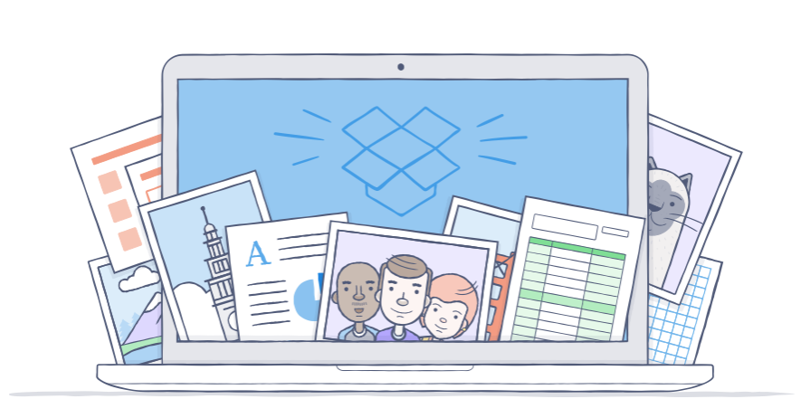

A Minimum Viable Products is the foundation of a lot of successful companies. When I recommend an MVP to clients, they are typically skeptical and ask for some examples of companies they know that started with an MVP.

## Twitter

Twitter was originally called twittr and developed as a way for Odeo employees to communicate with each other via SMS. There were no @replies, #hashtags or direct messages, just simple SMS messages.

## Groupon

Groupon was the byproduct Andrew Mason’s original startup called The Point, which was a collective action website that enabled people to come together to solve problems. Unfortunately, The Point was failing so Mason decided to pivot the company. He decided to sell a half-price offer to the pizza place at the bottom of his office building. While the collective action idea failed, the collective buying idea became incredibly viable.

## Zappos

Zappos wasn’t the largest online shoe store from day one. In fact, they didn’t even have a real ecommerce store to begin with. Instead, they took photos of shoes from the mall and added them to the website. If somebody was interested in the shoes, they would run to the mall, buy the shoes and ship them to the customer.

## Buffer

Buffer is a social media management tool designed for individuals and teams. Founder Joel Gascoigne had no idea if people wanted to use a product like Buffer, let alone pay for it. To test his idea, Joel created a landing page that explained the features and pricing and also had a sign up form. The landing page acquired enough users to validate their idea. They went on to build version one of Buffer and acquire their first user within seven weeks.

## Dropbox

Before Dropbox had a product, they launched a simple website with video explaining how the product works, the benefits and features. The video was designed to interest technology early adopters and it did just that. They acquired over 75,000 email signups and used those potential customers to get real feedback on a non-existent product.

Do you know any other successful companies that started with an MVP?
