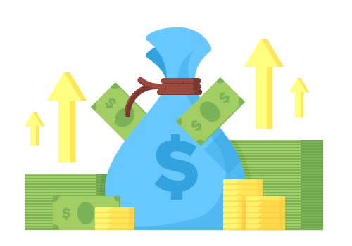
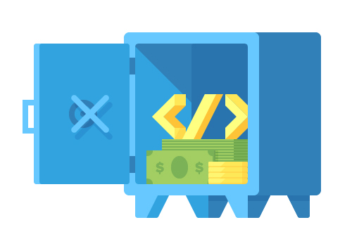

A few years ago, a client of Kohactive decided to rebuild their admin system. They are a white-label service and they have thousands of clients that use this platform. We inherited the app after a few years of offshore development. This was a big move for our client and we decided to slowly roll out the new admin over the course of the year.

We kicked it off with a multi-day workshop where we spoke to existing customers, reviewed the existing app and did some wireframing on the whiteboard. Over the course of the next few weeks, we went from hand drawn to high-fidelity wireframes. They looked awesome! We were psyched and so was the client.

After we finalized the clickable prototype I asked when we could start user testing.

He paused and looked up at me with raised eyebrows and asked: "why would we need to do that?"

"Well, this is a big project and a huge investment. Do you want to assume that we're right or would you rather we get feedback from customers and validate our assumptions? We might be wrong about a few things."

He knew the project was expensive. And in his eyes, I realized it was about to get more expensive. He asked, "Is that going to take a lot of time and money?".

"It doesn't have to" I paused, "but if we're wrong about anything, it's going to cost us a lot more to fix it later."

He'd been running the company almost a decade and knew the cost of bug fixing and changing functionality. He quickly looked back, smiled at me and said: "I'll get a few interviews set up".

## What is User Testing?

User testing is a technique of evaluating a product or service by testing it with representative users. There are many different types of user tests that suit different types of goals. User tests can be moderated or unmoderated and can range from simple five-second tests to hour-long tests. The goal is to identify any usability issues, collect data and determine the participants satisfaction with the product.

User testing is a cornerstone of [User-centered design](https://en.wikipedia.org/wiki/User-centered_design) and employed by many companies like Apple, IBM, Walt Disney, Starbucks, Nike and much more. It is an essential step in building products that people want and love.

## Benefits of User Testing

User testing has many benefits, whether you're testing a new product idea, introducing a new feature or redesigning an existing one. User testing allows a team to identify problems early and often. The earlier an issue is identified then the easier and cheaper it will be to fix.

### Increase Revenue

User testing is advantageous for companies. A [study by Motiv Strategies](https://hbr.org/2014/04/design-can-drive-exceptional-returns-for-shareholders/) shows that design-centric companies had a 228% higher ROI than the S&P 500 companies.

##### Increased Converstion Rates

An important way of increasing revenue is by optimizing conversion rates. Understanding why some customers sign up and why other don't is important. Using these learnings to prototype and test new checkout or onboarding flows will provide validated learnings. With user testing, you can iterate until you find the optimal conversion rates.

##### Improve Customer Retention

If you have a successful product, you know how important it is to stay ahead of the competition. Just because you have customers, it doesn't mean that they'll stay around when new and better competition enters the market. Constantly user testing your features and services will keep companies as market leaders and satisfy customer needs.

For our client above, competition is tough. Rather than just redesign and jump into development, taking the time to talk to users and conduct user tests was crucial to building products users love. Without learning what our customers wanted and what worked we would be prone to losing customers to new competitors.

##### Customer Advocacy

Not only does user testing lead to the retention of paying customers, it also creates brand advocates. Think about all the times you've fallen in love with a product and told all your friends about it.

User testing enables teams to build products their customers want and need. Likewise, taking the time to listen to your customers and make them part of your development processes attaches them to your brand. They feel like they are more than just customers, but part of the team. They'll advocate and become your largest source of free marketing.

### Reduce Your Development Costs

User testing wireframes or mockups can reduce development costs significantly. There is no benefit in building something that hasn't been validated by customers. An estimated [50% of engineering time](http://www.usability.gov/what-and-why/benefits-of-ucd.html) is spent doing rework that could have been avoided. Our client above learned this the hard way.

#### Avoid building features nobody cares about

One of the biggest mistakes I see entrepreneurs make is adding as many features as they can afford. While ideating about new features can be great, it's a waste of time to build them unless users actual want and need them.

A few years ago, during the design workshop with one of our clients, we discussed a particularly small feature. We tried to push back but our client was confident it was necessary. It wasn't going to be expensive to build either (it always feels like that, right?). This was a time before we pushed for user testing and so we ended up building the feature. Not many people actually use the feature but we have the burden of maintaining it for the very few that do.

#### Validate (or invalidate) assumptions about user behaviors

Every founder and designer start with assumptions about how their users are going to use their product. Sometimes they are spot on, other times they are incredibly surprised. This is especially important for existing products that are adding new features or redesigning existing ones.

In _The Lean Startup_, Eric Ries discusses how they build IMVUs Instant Messenger integration. They assumed users wanted to use existing software and just include an addon. In reality, their users wanted a completely separate community to engage with. They could have saved a lot of time and money by talking to customers, showing them a wireframe or prototype and learning.

##### Avoid building confusing navigations

When you build complicated product websites with hundreds of pages it's very easy to build difficult navigation systems. Rather than design, architect and develop your entire navigation system on an assumption, you can create clickable prototypes to test with users.

### Reduce Customer Support Costs

A product with usability issues results in two outcomes: users abandon the product or customer support calls. With diligent user testing and feedback, a user-friendly product can be built to satisfy the end users needs. The easier it is for the user to complete, the fewer support costs you'll incur.

### Find Bottlenecks

Whether you're building a simple or complicated product, user testing will identify potential bottlenecks in your product or service. Identity and fixing bottlenecks are important as these are the major point of drop off of customers.

One of our clients challenged us to build a complicated social, professional profile builder. We created a beautiful design with inline editing capabilities. We wanted users to be able to visualize their profile as they were building it. After some user testing, we found that users stalled when creating their vision board, which is a collage of imagery that defines who they are. After talking to users, we realized we need to add more options as well as educate the user. We added a simple onboarding model to explain the vision board. We also added some links to free stock photography website. Then we added the ability for them to add Facebook images.

## Conclusion

In conclusion, you should be user testing early and often. You don't need fancy tests and a giant team to get a start––in a follow-up to this article, we'll dive into the various techniques and platforms. Many startups and large corporations employ user testing on a regular basis to validate their assumptions and ensure they are building products that solve real customer problems.

[Click here to read the second part of this post.](./user-testing-techniques-and-platforms/)
