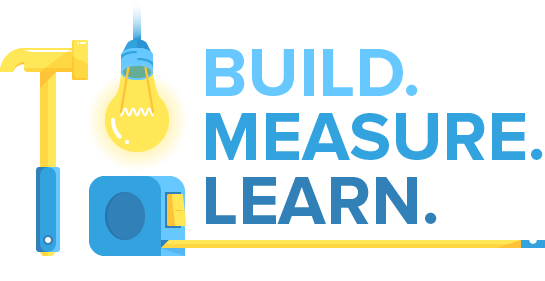
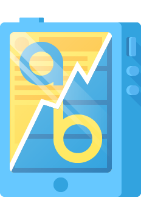
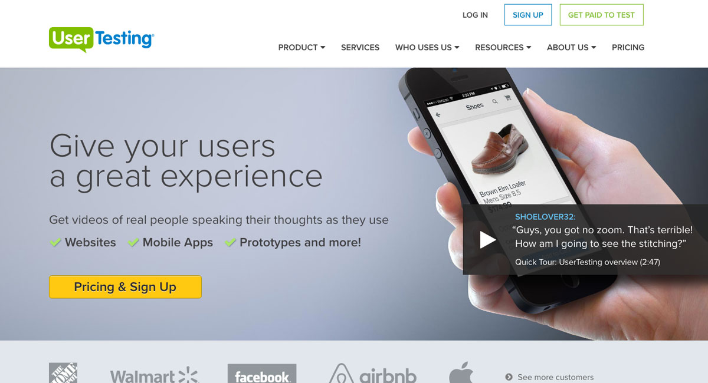
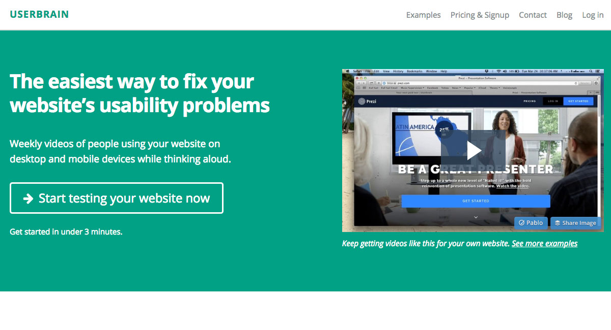
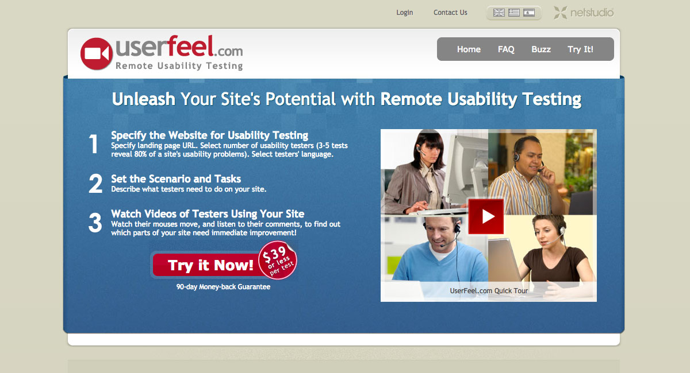
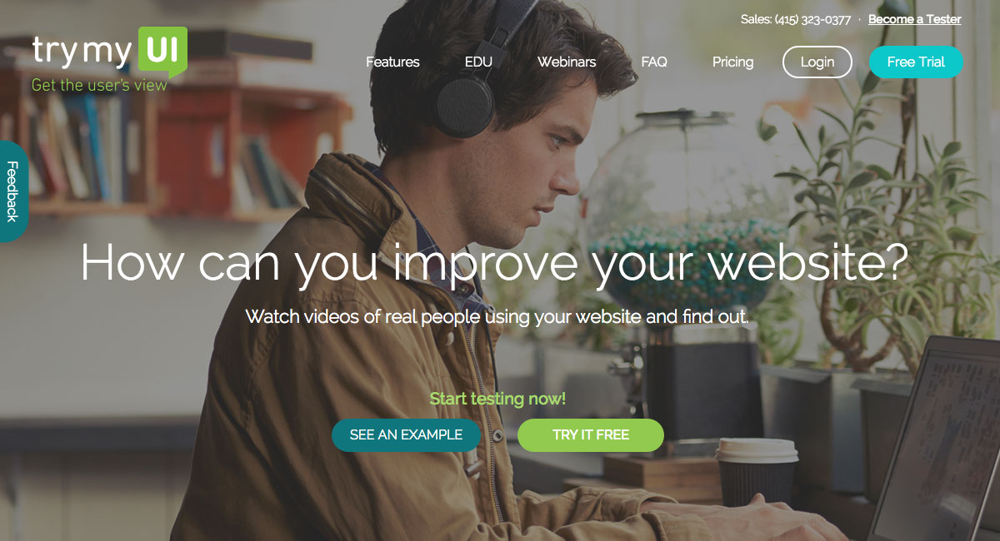
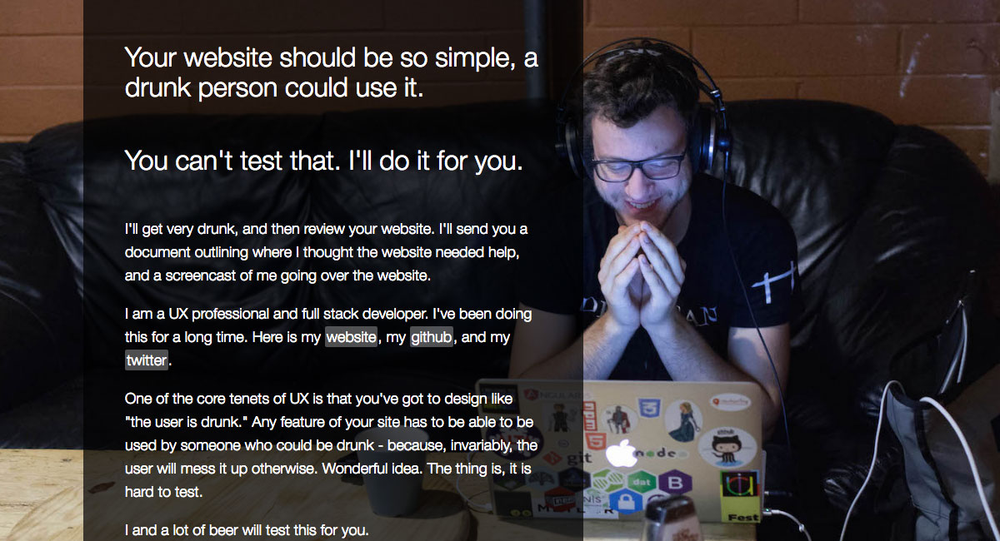
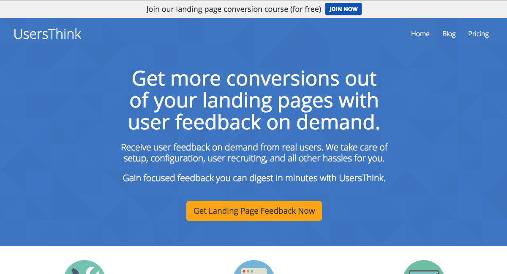
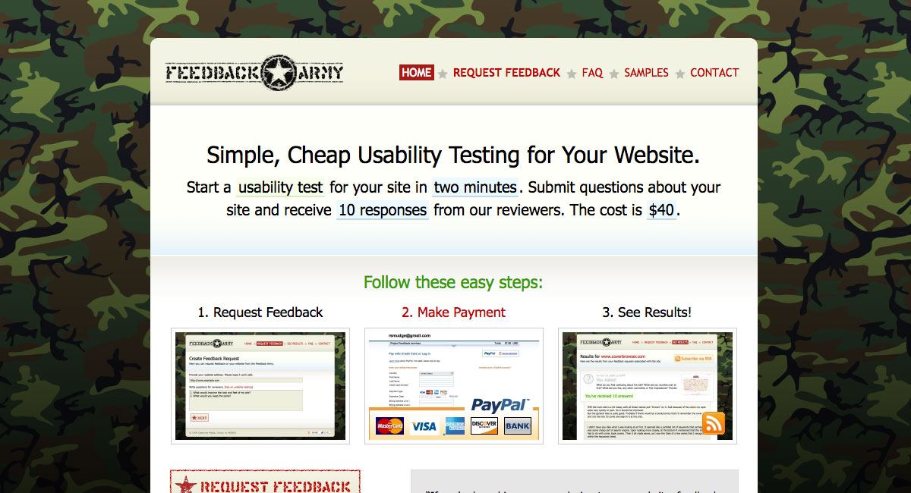

_This is a follow-up to another article. If you're interested in the benefits of User Testing, [check out the article](./user-testing-what-it-is-and-why-you-should-do-it/)_

A few years ago, we built an SMS-based photo sharing app called memms during an internal hackathon.

Once the core app was working, we built a basic onboarding flow for new users. We showed it to a few users and watched them go through the flow without any prompting. On the first touch point, each user asked the same questions about the input that prompted them for a phone number: "Is this my phone number or the one I'll be texting?"

It's not weird that they would ask this––memms is SMS based. A user would text their photos to a number and they would be shared with other participants of the event. When we designed the flows, the prompt wasn't a point of confusion at all. But when real users started to use the app, they were genuinely confused. So we changed the text prompt to say "Your mobile phone number."

But what if we didn't show any users and just launched the product? How many users would have been confused and lost interest when things didn't work out?

While this is a fairly simplified example of user testing, it helps illustrate how effective basic testing can be.

User testing isn't a new concept. In fact, it's [been around since World War II](http://www.thehumanfactorblog.com/2009/01/06/a-short-history-of-human-factors-and-ergonomics/). They didn't have touch screens back then, though––it was mostly machinery.

## User Testing Techniques

There are various user tests that you can conduct in order to gain insight into a specific problem. Regardless of what you’re testing, there are two ways to conduct a test:

- **Moderated**: A method in which a moderator is present to facilitate the test. (This can be done remotely as well.) During this type of test, the moderator can follow up and interact with the subject.

- **Unmoderated**: No facilitator is present and the user only has instructions to follow in order to complete the test. This is a good way to collect a lot of data quickly without much overhead.

Deciding which is best for you will depend on the objective. While unmoderated tests are much easier to perform, you will typically learn much more through the open dialog of a moderated test. The type of test you are performing will also help you determine the needs.

### Problem Discovery

Problem discovery tests are the most common type of usability test. These are very simple to conduct both moderated and unmoderated. During a problem discovery test, users are asked to perform a task in order to expose any problems or bottlenecks. A task could be signing up for an account, purchasing a product, or any kind of other core feature.

These tests are very easy to perform. There are some great products out there to help facilitate problem discovery tests with real users. With some products, you simply instruct users to complete a task and get feedback through a report, while other products offer videos of the users thinking aloud as they use your product.

### Benchmark

A benchmark test allows you to track your results over time. The first holistic benchmark test gives you the baseline usability of your product. After every major release or feature launch, you can conduct a usability test to compare with your previous benchmark.

### Five-Second test

Five-second tests are a great way to gain insights into your landing page. During the test, a user is presented with a design for five seconds, then asked what they remember. Users only [spend about 10-20 seconds](https://www.nngroup.com/articles/how-long-do-users-stay-on-web-pages/) before leaving your website, so optimization is vital. A five-second test allows you to validate that your value proposition sticks, giving you a chance to find out if users understand what you're selling or remember your brand.

### Preference Test

Not only are preference tests a great way to settle internal debates, but they’re also a simple way to predict which design will perform better. A preference test, as the name implies, is a simple test where a subject is presented two options and selects the one they prefer. These tests can be moderated or unmoderated. Due to their simplicity, you can easily create and share preference tests across multiple platforms.

### Competitive Test

If you have direct competitors in your market, you should always conduct a competitive usability test. If you haven't started building your product yet, then you can conduct a problem discovery test on another website to find bottlenecks in competitor products. If you have a product, you can run tests against multiple competitors to see how you stack up. Competitive tests can be wholistic––testing the entire product––or focused on a specific feature or function.

---

## When Should You User Test?

Always. I'm kidding. But not really. Plainly put: you should incorporate user testing into your process. If you look at methodologies like the Lean Startup, you'll see that user validation is a core component of the Build, Measure, Learn process. This is because user testing is key to ensuring that we're building products and services that solve problems for real users. Whether you're a one-person startup or a billion dollar company, bringing user testing into your process will improve your output and bottom line.

User testing should become a habit. A habit that you implement at any stage of your process. Whether you are building a new product or redesigning a feature, you can always user test.

Here’s an overview of some good points to start testing:

### Discovery Phase

When you've identified a potential problem that requires a solution, it's always good to start by doing some very basic user testing. Discovery phase testing should be simple and high level. What is the most minimal prototype you could create to conduct a user interview? Many times, you can mock something up in Keynote or Powerpoint and present it to a potential customer to gain a lot of feedback. Occasionally, you can even test a competitor’s product during the discovery phase to compare and glean insights.

Discovery phase user testing, if done right, should address quite a bit of uncertainty in your product or service. Are you building the right product? Do users understand it? Do they want it? These are all questions that discovery phase testing will answer. This initial step of testing could save you a lot of money and headaches down the road.

### Strategy Phase

User testing during the strategy phase will enable you to answer big questions about the solutions you’re building. If you have multiple solutions, then you can conduct user interviews to compare and learn which is the best one.

Creating various prototypes to test during this phase is crucial. These can be low-fidelity mockups or wireframes, as long as a user can meaningfully engage in the product and provide insight into what the experience would be like.

### UX & Design

Once you've validated your idea and solution, designing a great experience is key. Working with a designer, you can create high-fidelity wireframes and conduct various user tests. This is a great opportunity to conduct in-person, moderated problem discovery tests. While discovery and strategy phase testing can expose many issues, high-fidelity user testing will be the closest the user will get to the real product. You can even conduct unmoderated user tests, called "think out loud," where subjects talk out loud and provide video of their experience. (More details on that below.)

If you can, I recommend conducting user tests after wireframing, as well as design. But if I had to pick one, I'd say wireframes.

### Beta & Launch

Whether you have a beta period or [just do it live](https://www.youtube.com/watch?v=O_HyZ5aW76c), it's always important to conduct a user test of the product. While all of the other tests are based on prototypes and mockups, this phase of testing allows us to watch users actually use our product.

This is the phase where variable change comes into play. How does internet bandwidth affect the app? How about screen size? How about the speed of the app? In-person moderated tests, as well as platform based tests, are great for this phase.

By the time you reach beta-phase or launch, you and your team are too close to the app, and it's time to get a fresh perspective and some qualitative feedback.

---

## Platforms for Unmoderated Tests

There are quite a few platforms for user testing available, each with differences in features and services. When using a platform, there are two primary types of unmoderated tests that you can run: "think out loud" and design feedback testing.

### "Think Out Loud" Platforms

"Think out loud" platforms are a unique approach to unmoderated user testing. During these tests, the subject records themselves using the product and simultaneously thinks out loud. This approach provides you with much more information as the testers share their opinion and provide feedback during each step. If a user gets hung up somewhere, they can explain their thinking and confusion. This technique is great for problem discovery and benchmark testing.

"Think out loud" platforms are typically more expensive, but provide you with quite a bit of knowledge. Unlike a traditional preference test or navigation test, "think out loud" tests provide qualitative feedback about the user's experience.

Here are a few platforms that offer "think out loud" user testing services:

#### UserTesting

UserTesting is one of the most popular platforms around, and it's quite powerful. The dashboard allows you to break down the results of each task, such as speed and difficulty. You can benchmark each round of tests against the previous tests.

UserTesting is great for testing beta and prototypes that actually function. While you could test a clickable prototype or landing page, it's best served for getting feedback from users that can interact with a real application. You can even provide the tester with a few instructions like, "Find a pair of shoes and purchase them," or "Sign up and create your profile.”

UserTesting costs $49 per video (up to 10) and $99 per video following that. For only a few videos, those numbers could add up quickly. But if you're looking for high-quality feedback, then UserTesting is a great option.

**Website:**[usertesting.com](https://www.usertesting.com)

#### UserBrain

UserBrain is a "think out loud" platform that focuses primarily on websites and web-based applications, rather than mobile apps.

Unlike other platforms, UserBrain sends you weekly (or monthly) videos of users testing out your website. The goal is to make user testing an ongoing part of your process––which could be very powerful if you are changing your site frequently. UserBrain requires real websites that are available to a tester, so mockup and prototype testing is not an option.

UserBrain pricing varies. It cost $49/month for one video per week, and $139/month for 3 videos per week. There is also a cheaper option at \$29/month for a single video each month.

**Website:**[userbrain.net](https://userbrain.net/)

#### UserFeel

UserFeel is another platform that provides "think out loud" feedback from users. Similar to UserBrain, they focus on websites and web-based applications.

Compared to the other platforms, UserFeel is much more cost friendly with videos starting at \$39 or less. UserFeel also offers multilingual testing for those with international products.

Unlike other platforms, UserFeel requires that you create and pay for your first project (test) when you sign up.

**Website:**[userfeel.com](https://www.userfeel.com/)

#### TryMyUI

TryMyUI is another "think out loud" platform for both web and mobile apps. They have an interesting feature called The UXCrowd. This feature enables your users to define three things they liked, disliked, and would change about your product. Once they've completed the test, they will be presented with other user opinions and allowed to vote up and down on them. This feature is supposed to save you time and effort by allowing test users to enhance your UX.

Pricing for TryMyUI is somewhat complicated. They work on a credit system: 1 credit for web testing and 2 for mobile. They have a pay-as-you-go plan where you purchase credits for $35 each. Their monthly team plan is $299/month and includes 10 credits and the ability to test with your own users for one month. Agency and Enterprise plans include more credits and features but have no pricing.

**Website:**[trymyui.com](https://www.trymyui.com/)

#### The User Is Drunk

Some products require users to be in a certain state of mind. For example, a sports app might require that you play sports. If your app requires that your users be drunk, why not conduct drunk usability tests?

While this started out as a joke, this site actually became a small side business for the founder, Richard. Basically, he gets drunk and uses your app. Once he sobers up (I think), he'll send over a write-up of his findings and a video of his usage.

**Website:**[theuserisdrunk.com](https://www.theuserisdrunk.com/)

---

### Static Design & Prototype Testing

Unlike "think out loud" testing, static design and prototype testing allows you to conduct simple unmoderated tests to compare and validate designs and simple navigation systems. These kinds of tests are conducted early in your process before you have a functional product.

These tests are common for testing landing pages, e-commerce navigation, copy, and preference. Rather than use a functioning product, you simply test your designs or wireframes. Also, feedback will be simple and quantitative and will not provide any audio or video playback.

#### UsabilityHub

UsabilityHub is one of the most popular platforms for these kinds of tests. They focus on five primary test types:

1. Five Second Test
2. Click Test
3. Question Test
4. Navigation Test
5. Preference Test

Depending on your goals, you can create and manage the test that is required. With UsabilityHub, you select the number of responses you want, as well as basic demographic information.

Pricing is fairly simple: 1 credit per standard response and 3 per targeted response. They also offer a pro subscription for \$99 that provides a few additional features.

**Website:**[usabilityhub.com](https://www.usabilityhub.com/)

#### UserThink

UserThink is focused primarily on testing landing pages. They focus on helping you create landing pages that convert better through user testing and feedback. They support live websites as well as prototypes and mockups.

Testers on UserThink view your design and then answer custom questions. The responses are aggregated for your review following the test. The pricing is simple but not flexible. They offer three plans: $39 for 6 responses, $69 for 12 responses and \$99 for 18 responses.

**Website:**[userthink.com](https://www.userthink.com/)

#### Feedback Army

Feedback Army is focused mostly on feedback for a landing page. Their process is simple, and they boast that you can create a test in "two minutes.” You simply add a link and leave 4-6 questions to ask the testers. Their pricing is simple: each test costs \$40 and you'll receive 10 responses.

**Website:**[feedbackarmy.com](https://www.feedbackarmy.com/)

## Conclusion

Regardless of the size or phase of your startup, employing user testing as part of your process will help you build better and more successful products.

Remember that user testing is about uncovering and solving problems that real users will encounter. Whether you are in the discovery or beta launch phase, remember to identify a goal and select the appropriate type of test to conduct.

With a variety of available platforms, you can easily find one that fits your requirements and budget. Don't worry about trying to get it right the first time, just keep iterating and collecting feedback until you've found a solution that works.

All illustrations Ian Steele.
